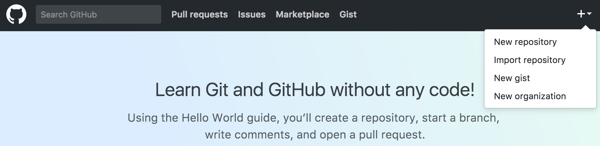
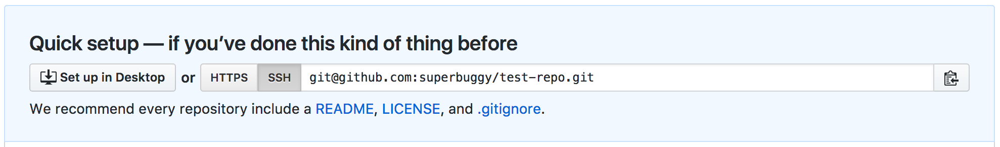
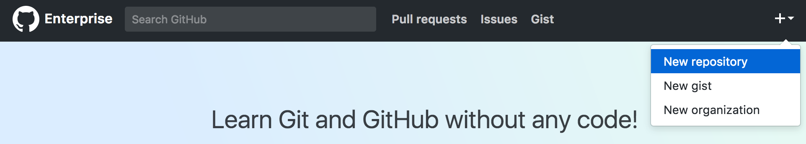
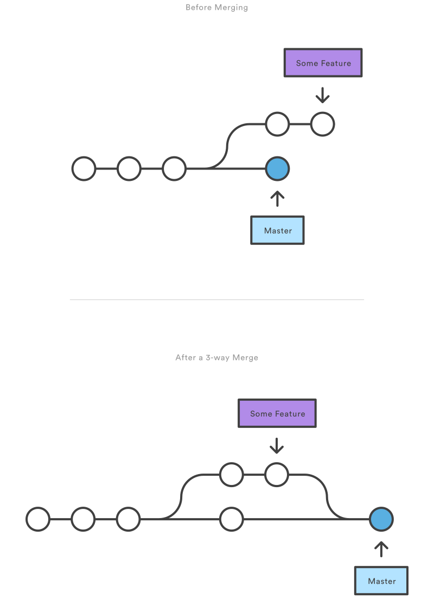

# Git Branching + Workflows

## Learning Objectives
- Explain what a branch is in git
- Create, merge, and delete branches on local and remote repositories
- Describe how branching and merging allows for collaboration during development
- Describe Github Workflows using issues, branches, and pull-requests
- Resolve a merge conflict

## Review (10 min, 0:10)

Quickly review the basics of git:

<details>
<summary>1. What is the purpose of git? How does it differ from GitHub?</summary>

> Git is a version control system allowing us to easily track files, manage changes and move between versions. GitHub is a web application that hosts remote repositories and allows developers to easily host and share code.

</details>

<details>
<summary>2. What command is used to start tracking a directory? What commands record the changes that occurred in the tracked directory?</summary>

> `$ git init` - create an empty Git repo
>
> `$ git add <file-path>` - stage file(s) for commit
>
> `$ git commit -m "message"` - commit staged files

</details>

<details>
<summary>3. What's the difference between a fork and a clone?</summary>

> A fork is when you copy a repository on GitHub to your own GitHub account.
>
> A clone is when you download a remote repository (likely from GitHub) to your local system.

</details>

<details>
<summary>4. What commands are used to share changes (commits) between local and remote repos?</summary>

> `$ git remote add <remote_name> <remote_url>` - add a remote repo with a given name and url
>
> `$ git push <remote_name> <branch_name>` - update a remote repo with commits from a branch of a local repo
>
> `$ git pull <remote_name> <branch_name>` - update a local repo with commits from a branch of a remote repo

</details>

---

## You Do: Managing Multiple Remotes

You probably have noticed we made you sign up for not only for a GitHub account (`github.com`), but also for a GitHub Enterprise account (`git.generalassemb.ly`). In some cases, you may want to push code you have on your GitHub Enterprise account to your GitHub account. These are 2 distinct remote hosts, but `git` allows us to push our code to multiple remotes.

1. Change to your home directory and type `git status` to ensure you don't have a repository initialized in your home directory.

```sh
 $ cd ~
 $ git status
```

If you are in your home directory and don't see the error message below after entering `git status`, flag down an instructor for assistance.

```
fatal: Not a git repository (or any of the parent directories): .git
```

2. Create a new directory in your home directory called `test-repo`.

 ```sh
$ mkdir test-repo
```

3. Change directory into `test-repo` and initialize a repository.

```sh
 $ git init
```

4. Next create a random file, then add and commit that file.

```sh
 $ echo "hello world" > random.txt
 $ git add random.txt
 $ git commit -m "add random.txt for testing purposes"
```

5. Create a repo called `test-repo` on your GitHub account



Click the green `Create Repository` button at the bottom.

6. Copy the clone URL to your clipboard.



7. Add a new remote, and then push to it.

```sh
 $ git remote add origin <PASTE CLIPBOARD CONTENTS HERE DONT COPY THIS PART>
 $ git push origin master
```

8. Refresh your GitHub `test-repo` page. You should see your commits reflected.

9. Create an identically titled repo called `test-repo` on your ***GitHub Enterprise account***.



10. Repeat steps 6-8 for `test-repo` on your GitHub Enterprise account.

---

## Why Branch (5 min, 0:15)

<details>
<summary>Q. Why is branching an important part of git?</summary>

> 1. To allow experimentation. By switching to a new branch, we can experiment, and if the experiment fails, we can delete it and easily switch back to master (or another branch of our choice). If it succeeds, we can merge those changes into master.
>
>
> 2. To allow work to proceed on multiple features (or by multiple people) without interference. When a feature is complete, it can be merged back into master.
>
>
> 3. To allow easy bug fixes on a stable version while features are being developed.
>
>
> 4. "Branch Early, Branch Often": Branches are lightweight, there is no additional overhead associated with branches, so it can be a great way to organize our workflow

</details>

---

## How Git Branching Works (15 min, 0:30)

In Git, branches are a part of your everyday development process. When you want to add a new feature or fix a bug — no matter how big or how small — you should set up a new branch to encapsulate your changes. This makes sure that unstable code is never committed to the main code base and it gives you the chance to clean up your feature’s commit history before merging it into the main branch.

Branches are incredibly lightweight "movable pointers" that help us as developers make experimental changes! A branch in git is just a label or pointer to a particular commit in a repository, along with all of it's history (parent commits).

What makes a branch special in git, is that we're always *on* a specific branch, and when we commit, the current branch HEAD moves forward to the new commit.

**Terminology:** HEAD is simply a reference to the current commit. By default, this is the most recent commit.


> The diagram above visualizes a repository with multiple lines of development, one is the master branch, and the others are feature branches. By developing in branches, it’s not only possible to work on branches in parallel, but it also keeps the main master branch free from questionable code.

---

## Merging (5 min, 0:35)

Now imagine that we have completed our awesome feature on its own branch and we want to bring those changes back into `master`, we now need a way to consolidate these two versions of our code base. The easiest way to do this is by  **merging** the feature branch into the master branch.

Let's see what this process looks like visually:



***Locally***, all we need to do is checkout (switch to) the master branch and then run the git merge command to integrate our feature branch:

```
$ git checkout master
```

```
$ git merge <feature_branch_name>
```


Once merged, you can delete the branch:

```bash
$ git branch -d <feature_branch_name>
```
***Remotely***, we could easily merge our branch back into master through a Pull Request and delete the branch on GitHub.

### You Do: Branching Exercise (15 min, 0:50)

We are going to start with a [brief tutorial](http://learngitbranching.js.org/).  This is an introduction to branching.

- Do Levels 1-3.  Stop at 4: "Rebase Introduction".
- Take your time:
  - Read all the dialogs.  They are part of the tutorial.
  - Think about what you want to achieve
  - Think about the results you expect *before* you press enter.
- Whenever you see/type `git commit`, you may assume changes have been made and staged (i.e. `$git add <file-path>`).  Why else would you "commit"?

> Please run this exercise using Chrome. It will not work properly in Safari or Firefox.

---

## Break (10 min, 1:00)

---

## Common Commands for Managing Branches (5 min, 1:05)

> `git branch <new_branch_name>` - create a new branch
>
> `git branch` - list local branches
>
> `git branch -r` - list remote branches
>
> `git branch -a` - list both remote & local branches
>
> `git checkout <branch_name>` - switch to a specific branch (checks out tip commit and makes branch active)
>
> `git checkout -b <new_branch_name>` - create a new branch and check it out in one step
>
> `git merge <branch_name>` - merges `<branch_name>` into the **current branch**, creating a new merge commit in the process
>
> `git branch -d <branch_to_delete>` - delete a branch
>  * git will not let you delete if branch isn't merged into another branch (i.e. would cause data loss)
>  * `git branch -D <branch_to_delete>` - overrides and deletes an unmerged branch - **be careful!**


[git cheat sheet](http://ndpsoftware.com/git-cheatsheet.html)

## Overview of a GitHub Workflow (10 min, 1:15)
> From [Github Guides](https://guides.github.com/introduction/flow/)

In Software Development, Github is very useful in managing and tracking updates and changes to our code.


#### Discuss

Discuss an idea for a new feature or any question about our project/application with our team and agree on what needs to be done.

#### Create an Issue

An Issue is a note on a repo regarding some matter that needs attention. It could be a bug, a suggestion for a new feature, a question about the repo or code, etc! On GitHub you can also label, search and assign issues, which help with managing projects.

It can be useful to write the issue as short functional spec, documenting the requirements as user stories.

[Issue for simple feature on GA Survey App](https://github.com/ga-dc/ga_exit_tickets/issues/8)

#### Create a Branch

Create a feature branch off the master to work on this issue. The branch name should reflect the issue or feature we are working on.

```bash
 $ git checkout -b <feature_branch_name>
```
> Example of good branch names: `fix-login-authentication`, `animate-nav-bar`


#### Work on your Branch and Commit Locally

Make changes, add, and commit locally, then push your branch up to the remote repository.

```bash
 $ git add <file-path>
```

```bash
 $ git commit -m "message"
```

```bash
 $ git push <remote_name> <feature_branch_name>
```
> Example: `$ git push origin fig-login-authentication`


#### Open a Pull Request (PR)

By making a pull request, you’re requesting that someone pull in your changes (commits) and merge them into the branch you are making the pull request against. A PR allows you to compare the content on two branches, and all the changes or diffs (differences) are highlighted in green and red.

As soon as you commit and push a change, you can open a Pull Request. People use Pull Requests as a medium for starting discussion about commits (code review) even before the code is finished. This way you can get feedback as you go or help from other developers/team members! This type of feedback can be extremely potent and productive since your code and its comments will have an evident thought process that will be the basis for targeted feedback on your code.

[PR for update to Installfest Script](https://github.com/ga-dc/installfest/pull/71)

#### Merge Branch into Master

It's good practice to even make a pull requests for branches in your own repository and merge it yourself to get more comfortable with PRs!

### We Do: GitHub Forking Workflow (10 min, 1:25)

Many open-source software (OSS) projects request that you create pull requests from a non-master branch.

1. ***Fork and Clone*** https://github.com/ga-wdi-exercises/git-tricks.
2. Create and switch to a feature branch called `<your_name>_suggestion`.
3. Type in your own "trick" aka git command/functionality you just learned (or researched) about.
4. Add and Commit your changes
6. Push your **feature branch** to your `origin` remote (your fork).
7. On GitHub, create a pull request from your **feature branch** to the upstream (ga-wdi-exercises) master branch.

## Merge Conflicts (10 min, 1:35)

Merging often does not go smoothly, so don't be alarmed! When git tries to automatically merge commit histories,  it sometimes fails due to conflicting changes. This is called a **merge conflict**.

```
Auto-merging <file_name>
CONFLICT (content): Merge conflict in <file_name>
Automatic merge failed; fix conflicts and then commit the result.
```

When we try to merge two branches (or commits from the same branch from a remote), changes may conflict. In this case, git will stop and ask us to fix the issues manually.

A "conflict" occurs when the commit that has to be merged has some change in the same place as the current commit.

To resolve a merge conflict:

1. Locate which files contain conflicts using `git status`
2. Open those files and fix the conflicts. (Look for the '<<<<', '====', and '>>>>' which will guide you to the conflict)
3. Commit the fixes.

```
<<<<<<< HEAD:file.txt
This is the original text in your current branch
=======
This is the modified text
>>>>>>> 77976da35a11db4580b80ae27e8d65caf5208086:file.txt
```

>The HEAD is a reference to the last commit in your current checked out branch. Anything between <<<<< HEAD and ===== is the original code from your checked out branch, while anything beneath from ===== to >>>>>> are the changes introduced by the commit you are trying to merge

## Break (10 min, 1:45)

## You Do, 1-2 Pairs: Centralized Workflow & Merge Conflicts (25 min, 2:10)

This exercise will pertain to a workflow where 2 individuals work on the same repository as collaborators. It will not involve forking and all work will be done on the `master` branch.

#### Find a Partner
  - Designate one person as the **repository owner**, and the other as the **contributor**.


#### Create a New Repo
  - **Repository Owner**:
    - In your `~/wdi/sandbox` directory, create a new directory named `merge-conflicts`.
    - Initialize `merge-conflicts` as a git repository and create an `index.html` file.
    - Work with the contributor to fill out the basic structure for the `index.html` file.
    - Include in the `index.html` file an `h1` tag with the content "Merge Conflicts", and a `p` tag with something new you learned about today.
    - Create a new repo **on Github** called `merge-conflicts` and add this repo as a remote repo for your local `merge-conflicts` repo.
    - Make sure to save and commit local changes and push up to the remote repo.
    - Add the contributor as a collaborator on GitHub (look up how to do this).


  - **Contributor**:
    - After they are added as a collaborator, they should clone the same repo. **Do not fork the Repo.**


#### Make Changes Locally
  - Both the Repository Owner and the Contributor should modify the `index.html` by changing both the `h1` and `p` elements.
    > The idea is to each make changes to the ***same thing***--a merge conflict will occur once the second set of conflicting changes are pushed

  - Add and Commit Changes Locally.

#### Push Commits to Remote
  - The repository owner should push up their changes first.
  - Then, the Contributor should do the same and try pushing up their changes.

#### Resolve Merge Conflicts
  - When the Contributor tries to push their commits, they should get an error message saying that the remote repo contains changes they do not have and instructing them to run `git pull origin master` to pull down these new changes.
  - The Contributor should get merge conflicts after the `git pull origin master` command is executed.
  - The Contributor should work locally (with the repository owner) on the Contributor's machine to resolve the merge conflicts by determining what content both want to appear in the file.
  - Once completed, add the resolved file(s), make a commit defining the conflict resolution, and push up changes to the remote repo.

#### Pulling Changes
  - Now, the repository owner should pull down the changes from the remote repo to sync with the changes the Contributor pushed.

## Closing (5 min)

Review Learning Objectives:
  - Explain what a branch is in git
  - Create, merge and delete branches on local and remote repositories
  - Describe how branching and merging allows for collaboration during development
  - Describe Github Workflows using issues, branches, and pull-requests
  - Resolve a merge conflict

Quiz Questions:
  - What is a feature branch in Git?
  - What CLI command will indicate the branch you are currently on?
  - How should you bring a new feature in the main branch?
  - What causes a merge conflict in git? How can a merge conflict be resolved?

## References & Additional Resources

  - [Common Git Errors](https://github.com/ga-wdi-lessons/git-review/blob/master/readme.md)
  - [Git-Guide](http://rogerdudler.github.io/git-guide/)
  - [Atlassian - Git Merging versus Rebasing](https://www.atlassian.com/git/tutorials/merging-vs-rebasing/)
  - [Github - Git-Command-Cheat-Sheet](https://education.github.com/git-cheat-sheet-education.pdf)
  - [Git Book - Git Branching - Basic Branching and Merging](https://git-scm.com/book/en/v2/Git-Branching-Basic-Branching-and-Merging)
  - [Atlassian - Git Branching Tutorial](https://www.atlassian.com/git/tutorials/using-branches)
  - [Interactive Git Branching Tutorial](http://pcottle.github.io/learnGitBranching/) - [Git Cheat Sheet](http://ndpsoftware.com/git-cheatsheet.html)
  - [Git from the Bottom Up](https://jwiegley.github.io/git-from-the-bottom-up/)
